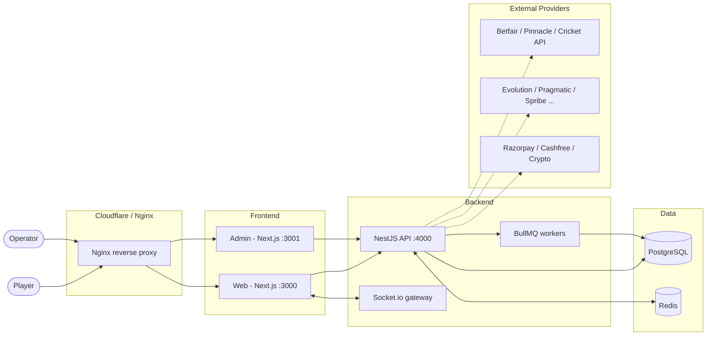
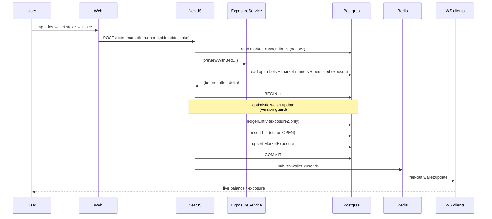
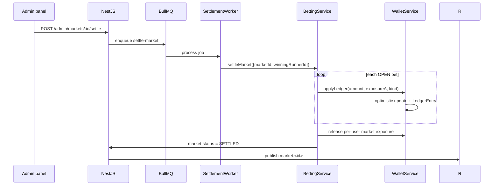
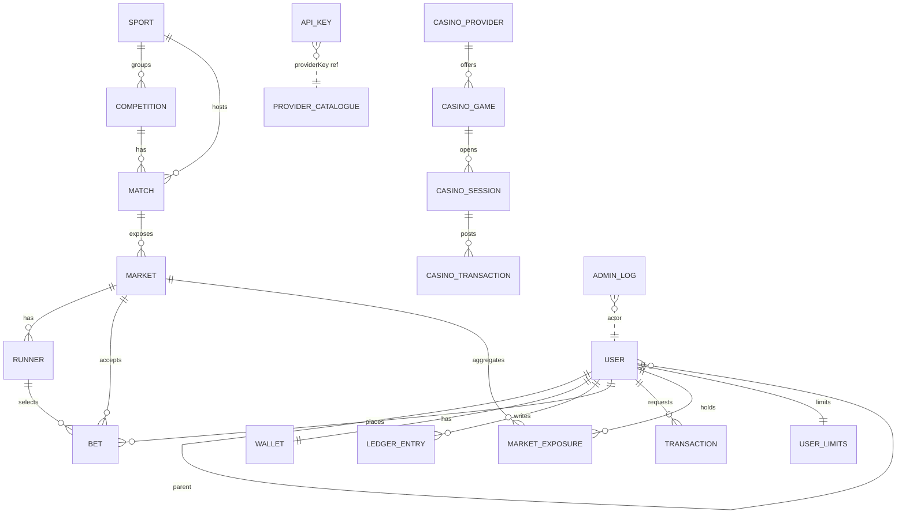
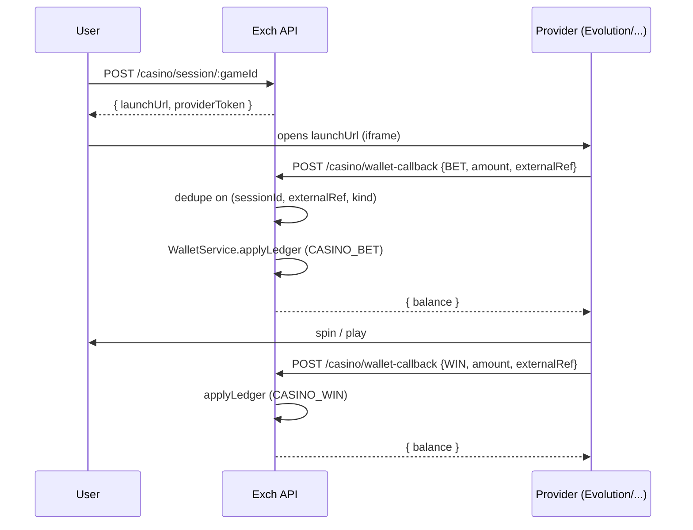

# Exch — White-Label Betting Exchange & Casino Platform

A modern, full-stack betting exchange + casino built from scratch. Cricket / football / tennis exchange with back-lay markets, fancy / bookmaker / session markets, a casino lobby with provider-agnostic launch + seamless-wallet callbacks, a multi-tier agent system (Super Admin → Agent → User), and a full admin panel with **CRUD for every external provider's API keys**.

> Reference UIs: Diamond Exchange, Future9 Club, Sky Exchange, Betfair.
> Theme: dark luxury — deep maroon / black / dark-red with orange-gradient highlights, glassmorphism, neon glow.

---

## What's built (and what isn't)

The platform you generate from this repo is a **working foundation**, with four pieces that are production-shaped because you explicitly asked to own them:

| Subsystem | Status |
|---|---|
| Wallet ledger (atomic, optimistic-concurrency, double-entry) | **Built** |
| Exposure engine (per-runner P/L, per-market worst-case, wallet-exposure delta) | **Built** |
| Betting engine (back/lay placement, settlement, void, fancy support) | **Built** |
| Admin panel (users, deposits, withdrawals, markets, manual odds, risk, API-keys CRUD, logs) | **Built** |
| Agent hierarchy (6 roles, parent-chain, partnership %) | **Built** |
| Auth (JWT + refresh rotation + TOTP 2FA) | **Built** |
| Real-time websocket (Redis pub/sub fan-out for odds + wallet) | **Built** |
| Casino integration layer (seamless wallet callbacks, idempotent) | **Built** |
| Cricket API ingestion (free demo token, completed competitions) | **Built** |
| Provider-specific adapters (Betfair Stream, Evolution, Pragmatic, Spribe, …) | **Stubbed** — API-key CRUD ready; concrete adapter calls land per provider once credentials are in hand |
| KYC / payment-gateway processing | **Stubbed** — UI scaffolded, requires gateway credentials |
| PWA service worker | **Manifest only** — register a SW when you're ready to ship offline-first |

Anything not listed above (e.g. multi-language, full mobile-app shell, advanced fraud rules) is intentionally not in v1.

---

## Tech stack

**Frontend (`apps/web` + `apps/admin`)** — Next.js 14, React 18, TypeScript, Tailwind, Framer Motion, Zustand, SWR, socket.io-client. App-router, dark-luxury palette in `tailwind.config.ts`.

**Backend (`apps/api`)** — NestJS 10, Prisma 5, PostgreSQL 16, Redis 7, BullMQ, socket.io, JWT (Passport), Throttler.

**Infra (`infra/`)** — Docker Compose with Postgres + Redis + API + Web + Admin + Nginx reverse proxy. PM2 ecosystem file for bare-metal alternative.

**Shared (`packages/shared`)** — Types and the provider catalogue (`API_KEY_PROVIDERS`) shared between web, admin, and API.

---

## Quick start

```bash
# 1. Install deps (pnpm 9, Node 20+)
corepack enable
cd platform
pnpm install

# 2. Bring up infra
cp .env.example .env
docker compose -f infra/docker-compose.yml up -d postgres redis

# 3. Generate Prisma client, run migrations, seed
pnpm db:generate
pnpm db:migrate    # creates `prisma/migrations/*` and applies them
pnpm db:seed       # sports + casino providers + bootstrap super-admin

# 4. Run all three apps in parallel
pnpm dev
```

| URL | Service |
|---|---|
| http://localhost:3000 | User web (Exchange, Casino, account) |
| http://localhost:3001 | Admin panel (login with `superadmin` / `ChangeMe!Now2026`) |
| http://localhost:4000/api | NestJS API |
| ws://localhost:4000/socket.io | Live odds + wallet websocket |

Then from the admin panel:
1. **Settings → Import series** to pull completed cricket competitions into the DB.
2. **API Keys** to enter Betfair / Evolution / etc. credentials.
3. **Markets** to manually set odds and settle markets for testing.

---

## Repo layout

```
platform/
├── apps/
│   ├── api/      NestJS — auth, wallet, exposure, betting, markets, casino, admin, realtime
│   ├── web/      Next.js user site (dark luxury, Future9-style)
│   └── admin/    Next.js admin panel
├── packages/
│   └── shared/   Types + provider catalogue
└── infra/        Docker compose, Dockerfiles, nginx.conf, PM2 ecosystem
```

---

## Architecture

### High-level



### Bet placement flow



### Settlement (queue + worker)



### Database ER (core entities)



### Casino seamless-wallet flow



---

## The wallet invariant

Every wallet mutation goes through `WalletService.applyLedger`, which inside a Prisma `$transaction`:

1. reads the wallet,
2. computes `(balance + amount, exposure + exposureΔ)`,
3. updates the wallet with an **optimistic version guard** (`updateMany` with `version`); retries on conflict,
4. writes an immutable `LedgerEntry` row stamped with `balanceAfter` / `exposureAfter`,
5. publishes `wallet.<userId>` on Redis for real-time UI.

Constraints:
- `balance - exposure >= 0` (unless `allowNegative: true` — admin debits, rollbacks).
- `exposure >= 0`.
- Optimistic concurrency: 5 retries before surfacing a 409.

This makes the ledger the source of truth — `sum(amount)` per user always equals `wallet.balance`.

---

## Exposure model (back/lay)

For each `(user, market)`, `ExposureService` computes:

- **Per-runner P/L** — for each possible winner, the net profit/loss across all of the user's open bets on that market.
- **Worst-case** — the most negative outcome, floored at 0. This is what we lock in `wallet.exposure`.

```
BACK on R, win  : +stake * (odds - 1)     for runner R
BACK on R, lose : -stake                  for every other runner
LAY  on R, win  : -stake * (odds - 1)     for runner R
LAY  on R, lose : +stake                  for every other runner
```

`previewWithBet` returns `delta = newWorstCase - persistedWorstCase` which feeds straight into the wallet ledger.

---

## Admin → API Keys

Every external provider you'll ever need is enumerated in [`packages/shared/src/constants.ts`](packages/shared/src/constants.ts). The admin panel renders them grouped by category with the exact fields each provider needs:

| Category | Providers (default) |
|---|---|
| Sports | Betfair Exchange, Betfair Stream, Pinnacle, The Odds API, Cricket API |
| Casino | Evolution, Pragmatic Play, Vivo Gaming, Ezugi, SA Gaming, Playtech, Mac88 |
| Crash | Spribe (Aviator), SmartSoft, Turbo Gaming |
| Slots | Jili |
| Virtual | TVBet, BetGames |
| Payment | Razorpay, Cashfree, Crypto Wallet Gateway |

Add more by appending to `API_KEY_PROVIDERS`. Secrets are AES-256-GCM encrypted; the UI shows last-4 hints only. Server-side adapters call `ApiKeysService.revealForServer(providerKey)` to decrypt on demand.

---

## Security checklist

- **HTTPS** at the edge — terminate on Nginx (Certbot) or Cloudflare.
- **Rate limit** — `@nestjs/throttler` is wired (120 req / 60s default; tune per route as needed).
- **JWT** — short-lived access (15m), refresh rotation, hashed in DB, revoke on logout/password reset.
- **2FA** — TOTP via `speakeasy`; QR code rendered server-side.
- **Encrypted credentials** — AES-256-GCM at rest; key derived from a dedicated `API_KEY_ENCRYPTION_SECRET` (rotate to a KMS-managed key in production).
- **Audit log** — every admin action writes to `AdminLog` with actor + IP + metadata.
- **Casino callback idempotency** — unique `(session, externalRef, kind)` index dedupes replays.

For production, add: IP allow-list for admin and provider webhooks, HMAC-signed provider callbacks, Cloudflare WAF rules, and full pen-test before going live.

---

## Deployment (Hostinger VPS KVM4)

```bash
# On the VPS
git clone <your repo>
cd platform
cp .env.example .env  # set strong secrets!
docker compose -f infra/docker-compose.yml up -d --build
```

Nginx in the compose stack proxies:
- `/`              → user web
- `admin.*`        → admin panel
- `/api/*`         → API
- `/socket.io/*`   → API (websocket upgrade)

Drop Cloudflare in front when you have a domain — set "Full (strict)" SSL and put the orange cloud on.

---

## Where to extend next

1. **Real provider adapters.** Drop the actual Betfair Stream / Evolution / Pragmatic SDKs in `apps/api/src/modules/providers/<provider>/` and wire each to the existing `ApiKeysService.revealForServer(...)` + `MarketsService.setRunnerOdds(...)` + `CasinoService.walletCallback(...)`.
2. **Order-matching exchange** — current model is a single-counterparty exchange (the operator). To run a true peer-to-peer order book, extend `Bet` with `matchedAmount`/`unmatchedAmount` and a matching engine in a Redis sorted set.
3. **Commission / partnership rollups** — `Bet.parentChain` snapshots the upline at place-time. Add a settlement-time worker that posts `COMMISSION_PAYOUT` ledger entries up the chain.
4. **Mobile PWA** — register a service worker (already have `manifest.webmanifest`).
5. **Settlement automation** — wire the Cricket API (or whichever feed has live scores) into a periodic job that calls `SettlementService.enqueue(...)` automatically.

---

## License

This codebase is yours. Operating a real-money betting service requires a gambling licence in your jurisdiction and KYC/AML/responsible-gaming controls. The platform is technical — the legal stack is on you.
